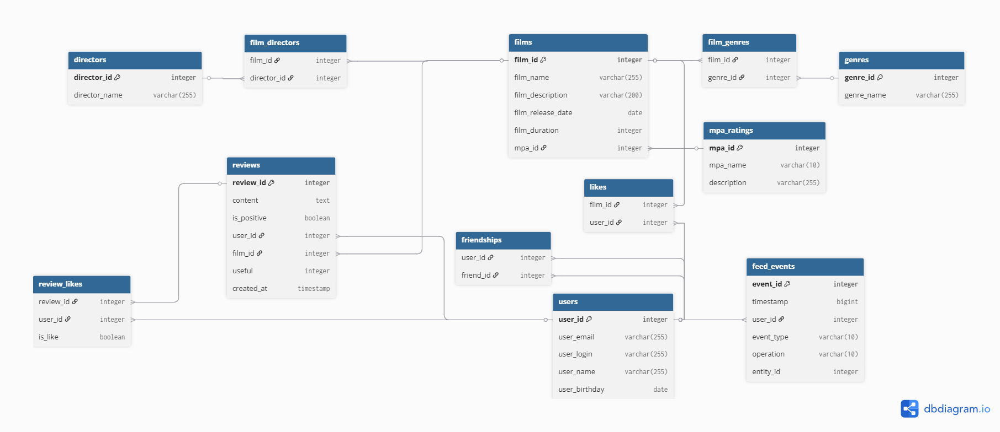

# java-filmorate
Template repository for Filmorate project.

## Схема базы данных


### Особенности схемы
✅ **Нормализованная структура**  
Данные не дублируются, связи реализованы через внешние ключи  
✅ **Поддержка всех функций приложения**  
Лайки, друзья, жанры, рейтинги MPA  
✅ **Оптимизированные запросы**  
Быстрый поиск популярных фильмов, общих друзей и фильмов по жанрам

### Примеры SQL-запросов

#### 1. Пользователи
**Получение всех пользователей:**
```sql
SELECT * FROM users;
```

#### 2. Фильмы
**Топ-5 популярных фильмов:**
```sql
SELECT f.*, m.mpa_name, COUNT(l.user_id) AS likes_count
FROM films f
JOIN mpa_ratings m ON f.mpa_id = m.mpa_id
LEFT JOIN likes l ON f.film_id = l.film_id
GROUP BY f.film_id
ORDER BY likes_count DESC
LIMIT 5;
```

**Фильмы по жанру:**
```sql
SELECT f.*, m.mpa_name
FROM films f
JOIN mpa_ratings m ON f.mpa_id = m.mpa_id
JOIN film_genres fg ON f.film_id = fg.film_id
JOIN genres g ON fg.genre_id = g.genre_id
WHERE g.genre_name = 'Комедия';
```

**Фильмы по рейтингу MPA:**
```sql
SELECT f.*, m.mpa_name, m.description
FROM films f
JOIN mpa_ratings m ON f.mpa_id = m.mpa_id
WHERE m.mpa_name = 'PG';
```

#### 3. Социальные функции
**Друзья пользователя:**
```sql
SELECT u.* 
FROM users u
JOIN friendships f ON u.user_id = f.friend_id
WHERE f.user_id = 1;
```
